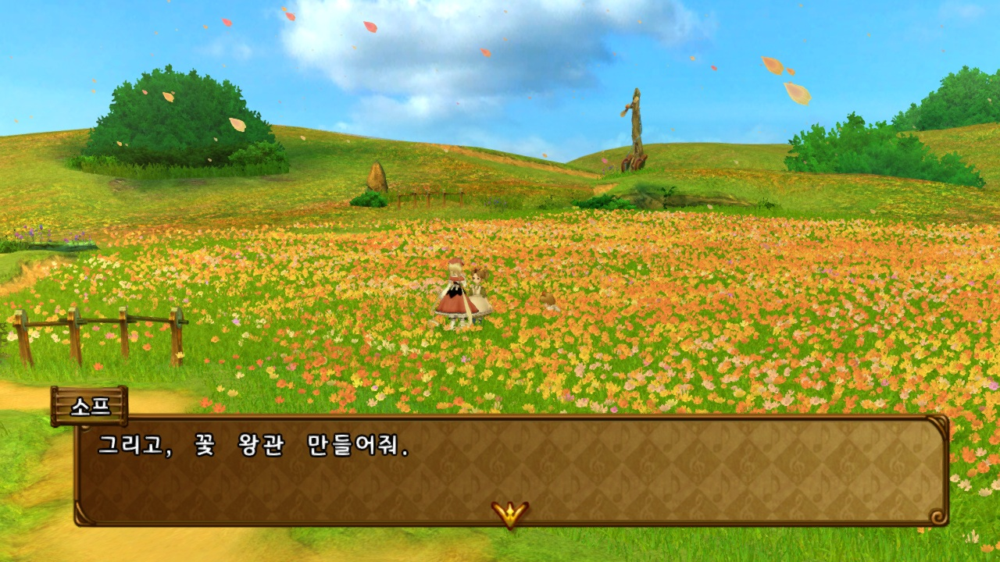
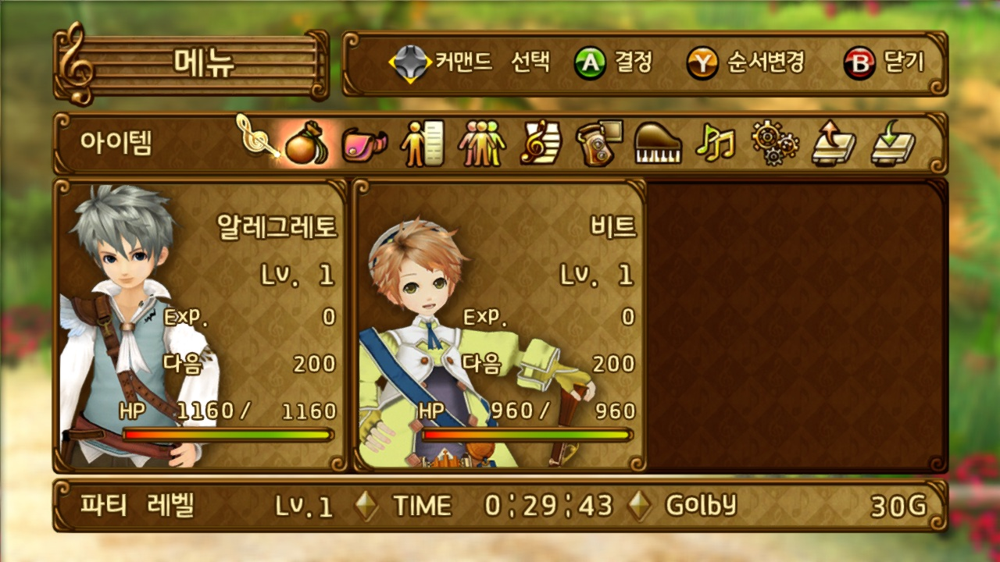

# 트러스티 벨 한글 패치 프로그램

Xbox 360 일본판 `트러스티 벨` ISO에 현재 확정된 한글 패치(AI 번역)를 적용하고 새 ISO로 재패킹하는 프로그램입니다.

## 샘플

## 사용법

1. 일본판 ISO를 창에 드래그하거나 클릭해서 선택합니다.
2. XEX 영역의 추가 번역도 적용하려면 사용자가 준비한 `xextool.exe`를 함께 선택합니다. 이 파일은 선택 사항입니다.
3. `패치 시작`을 누릅니다.
4. 완료된 ISO는 원본과 같은 폴더에 `<원본 파일명>_repacked.iso`로 저장됩니다.

출력 경로는 자동으로 결정됩니다. 같은 이름의 결과물이 이미 있으면 덮어쓸지 확인합니다. 임시 추출 폴더는 성공 시 자동 삭제하며, 실패 시 진단을 위해 보존합니다.

## 적용 범위

- 대부분의 대화 텍스트
- 한글화된 UI 이미지
- 시스템 메뉴 및 아이템 정보 (xextool.exe 필요) [다운로드](https://digiex.net/threads/xextool-6-3-download.9523/)

## 실행 요구 사항

- Windows 10 이상

## 다운로드
**[릴리즈 페이지](../../releases)** 에서 다운로드하세요.

본 패치를 다운로드하거나 사용하는 경우 아래의 면책조항 및 이용안내를 확인하고 이에 동의한 것으로 간주합니다.

## 면책조항

본 프로젝트는 비영리 목적의 팬 번역 프로젝트이며, 원작의 저작권은 해당 권리자에게 있습니다.

본 프로젝트는 게임 데이터, 실행 파일 또는 기타 저작권이 있는 원본 데이터를 포함하거나 배포하지 않습니다.

패치를 사용하려면 사용자가 합법적으로 취득한 원본 게임이 필요합니다.

프로젝트 운영자는 본 패치의 사용으로 인해 발생하는 어떠한 손해나 문제에 대해서도 책임을 지지 않습니다.

권리자의 요청이 있을 경우 본 프로젝트는 관련 자료의 공개를 중단하거나 삭제하는 등 필요한 조치를 취할 수 있습니다.

## 라이선스

이 프로젝트는 MIT License를 따릅니다. 자세한 내용은 LICENSE 파일을 참고해 주세요.

Copyright (c) 2026 Gideon

재배포시에는 현재 페이지의 링크를 같이 포함해 주시면 감사하겠습니다.

### Fonts

이 프로젝트는 경기천년체 폰트를 사용하고 있습니다.

© GYEONGGI PROVINCE. All Rights Reserved.

### Third-Party Software

This product includes software developed by in <in@fishtank.com>.

자세한 내용은 'docs/THIRD_PARTY_NOTICES' 디렉터리를 참고해 주세요.

---

Developed with GPT-5.x · Translated with Gemma 4
